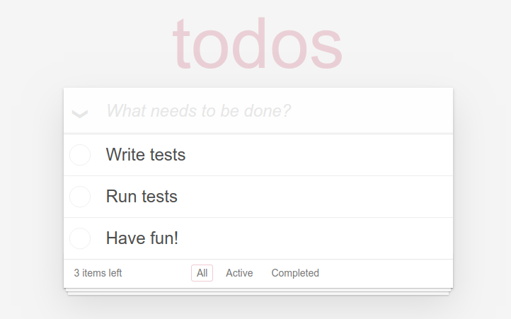

This repo contains tests for TodoMVC application written with Typescript.
Tests can be executed via different helpers.



# Installation

This is a playground for your first steps in testing with Typescript, so instead of installing it from NPM it is recommended to clone it from repo instead and then install the dependencies:

```
git clone git@github.com:codecept-js/examples-ts.git codeceptjs-examples-ts && cd codeceptjs-examples-ts && npm i
```

This will also install CodeceptJS with Puppeteer, WebdriverIO & TestCafe packages. 

# Running Tests

The default helper is Playwright.

## Playwright

Use `codecept.conf.ts` to run tests with Playwright:

```
npx codeceptjs run --steps
```

## Puppeteer

Use `codecept.puppeteer.conf.ts` to run tests with Puppeteer:

```
npx codeceptjs run --steps -c codecept.puppeteer.conf.ts 
```


## WebdriverIO

Use `codecept.webdriver.conf.ts` to run tests with WebdriverIO in Chrome:

```
npx codeceptjs run -c codecept.webdriver.conf.ts --steps 
```

## TestCafe

Use `codecept.testcafe.conf.ts` to run tests with TestCafe in Chrome:

```
npx codeceptjs run -c codecept.testcafe.conf.ts --steps 
```

## Headless Mode

Run tests in headless mode:

```
HEADLESS=true npx codeceptjs run --steps
```

## Parallel Execution

Run tests in parallel with 3 workers:

```
npx codeceptjs run-workers 3
```

## Credits

Inspired by the examples in JS.
Maintained by CodeceptJS Team.

## LICENSE

MIT
